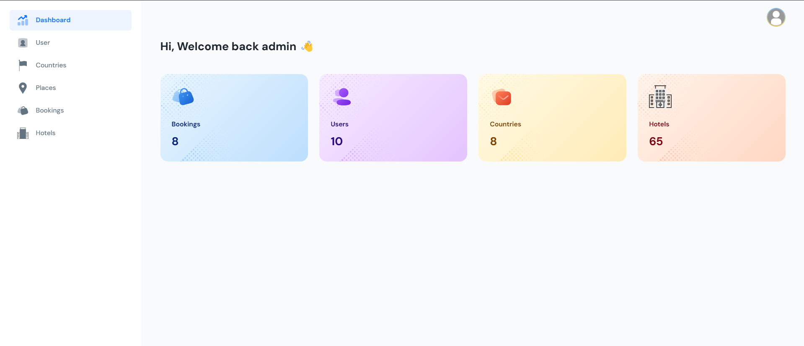
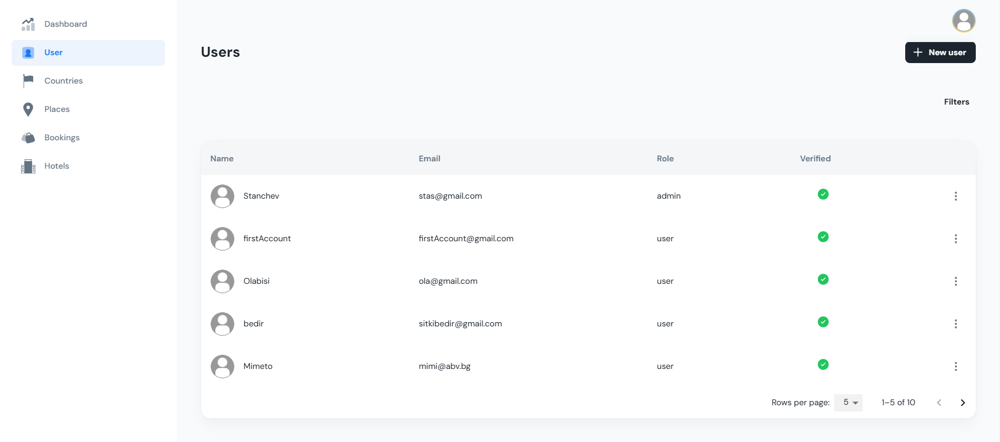
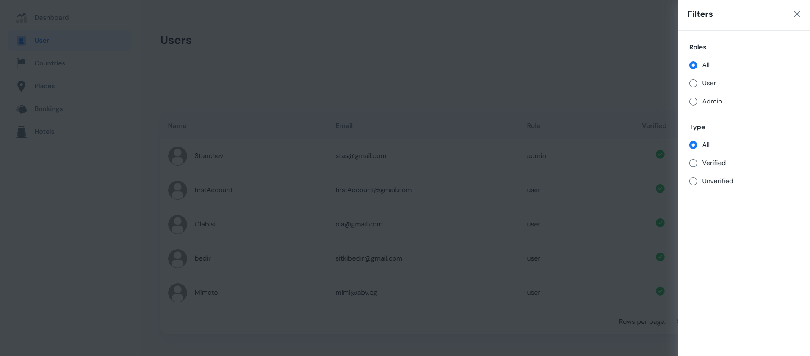
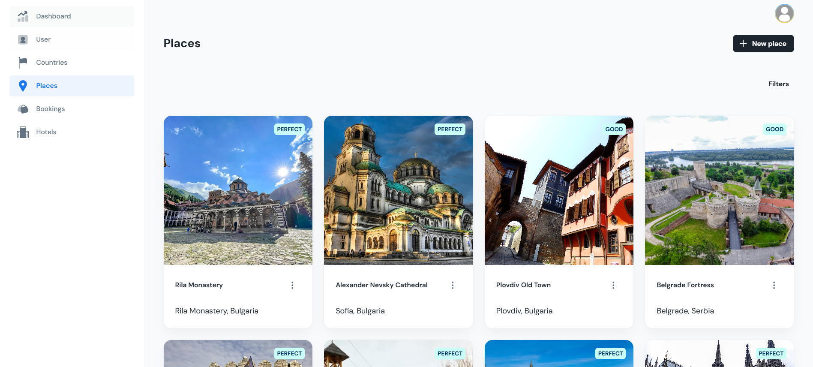
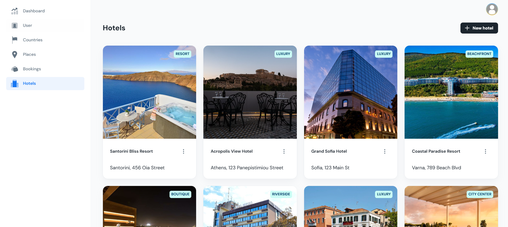

# 🌍 Country-Explorer-Dashboard

> React Admin Dashboard made with MaterialUI, React and Vite.js.

## ✨ Features

- **🔐 User Manage:** Create, update, delete, and manage user accounts with ease.
- **🌏 Countries Manage:** Perform CRUD operations for countries.
- **🏙️ Places Manage:** Full CRUD functionality for places..
- **🏨 Hotels Manage:** Efficiently manage hotels with CRUD operations.
- **🛏️ Bookings:** Manage bookings.

## 🛠️ Technologies Used

- **🛠️ Vite.js**
- **⚛️ React.js**
- **📊 Material UI**
- **🧭 React Router**
- **🌐 Axios for API calls**
- **📝 Formik and Yup for form handling and validation**

## Quick start

- Clone the repo: `git clone https://github.com/Stanislav001/Country-Explorer-Dashboard.git`
- Recommended: `Node.js v20.x`
- **Install:** `npm i` or `yarn install`
- **Start:** `npm run dev` or `yarn dev`
- **Build:** `npm run build` or `yarn build`
- Open browser: `http://localhost:3039`

## Give a Star ⭐

If you find this project useful, please consider giving it a star! It helps to show appreciation for the effort put into this project.

## 📸 Screenshots

## Contact with me

Email: stanchev1002@amgil.com